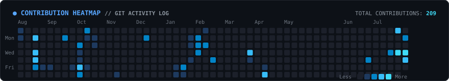

<div align="center">

<h3><code>amitabh@security-node ~ $ neofetch</code></h3>

<a href="https://github.com/AmitabhMorey">
  <picture>
    <source media="(prefers-color-scheme: dark)" srcset="./assets/dark_mode.svg">
    
  </picture>
</a>

<br><br>

<h3><code>amitabh@security-node ~ $ ./contributions.sh --year 2026</code></h3>

<a href="https://github.com/AmitabhMorey">
  
</a>

<br>

<a href="https://github.com/AmitabhMorey">
  
  
</a>

<br><br>

<h3><code>amitabh@security-node ~ $ cat ~/.config/arsenal.json</code></h3>

</div>

```json
{
  "systems_and_security": [
    "Rust", "Go", "C++", "C", "Python", "Nmap", "Wireshark", "Shodan", "AES-256", "Docker", "POSIX Shell"
  ],
  "cloud_apps_and_data": [
    "TypeScript", "JavaScript", "Dart / Flutter", "Java (Spring Boot 3)", "FastAPI", "Astro 5", "Supabase", "PostgreSQL", "Neo4j"
  ],
  "active_explorations": [
    "Network Protocol Analysis", "P2P End-to-End Encryption", "Agentic Systems", "Reverse Engineering"
  ]
}
```

<div align="center">

<br>

<h3><code>amitabh@security-node ~ $ ping -c 3 signal.net</code></h3>

<p>
  <a href="https://www.linkedin.com/in/amitabh-morey-906984248/">
    
  </a>
  &nbsp;
  <a href="https://x.com/beingamitabh">
    
  </a>
  &nbsp;
  <a href="mailto:amitabhmorey1@gmail.com">
    
  </a>
</p>

<br>

<sub><code>[ Process completed with exit code 0 ]</code></sub>

</div>
