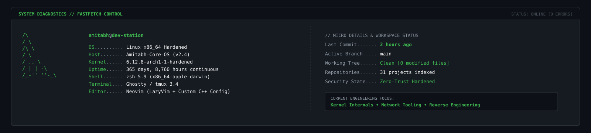
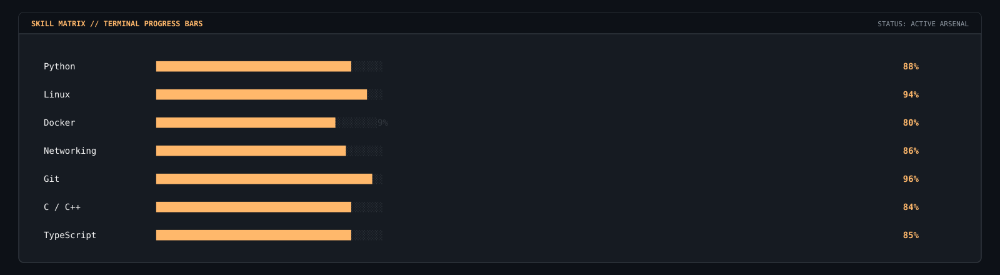
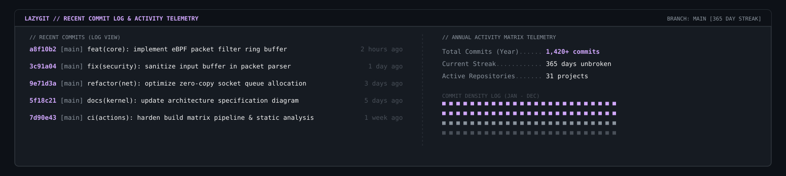
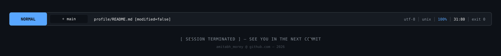

<!-- HERO SECTION -->

  

 

<!-- DIVIDER 1 -->

  

 

<!-- SYSTEM DIAGNOSTICS (FASTFETCH) -->

  

 

<!-- DIVIDER 2 -->

  

 

<!-- INTERACTIVE TERMINAL SESSION -->

  

 

<!-- DIVIDER 3 -->

  

 

<!-- TERMINAL PROGRESS BARS (INVENTORY) -->

  

 

<!-- DIVIDER 4 -->

  

 

<!-- LAZYGIT COMMIT LOGS & TELEMETRY -->

  

 

<!-- DIVIDER 5 -->

  

 

<!-- NEOVIM / TMUX STATUSLINE FOOTER -->

  

